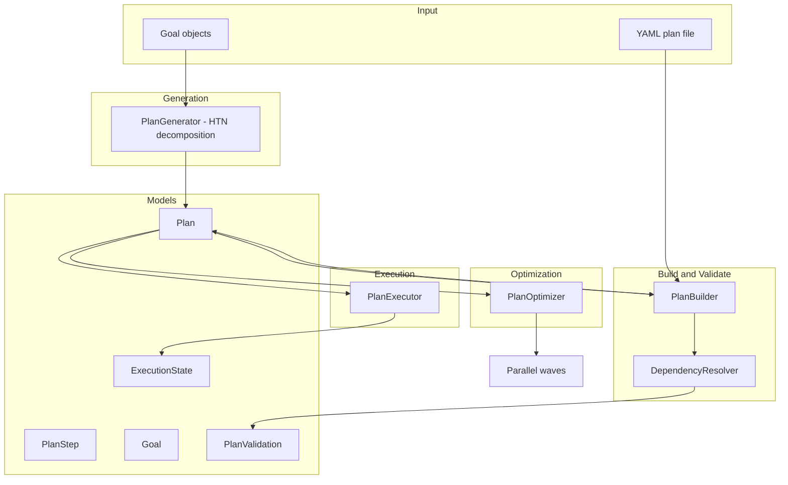

# aumai-planforge

**Agent planning and strategy generation — decompose goals into sub-tasks, generate execution plans, and track plan progress.**

[](https://github.com/aumai/aumai-planforge/actions)
[](https://pypi.org/project/aumai-planforge/)
[](LICENSE)
[](https://python.org)

---

## What is this?

aumai-planforge is the planning backbone for AumAI agents.

When you give an agent a complex goal — "migrate this database", "onboard this customer", "resolve this incident" — it cannot act on that goal directly. It needs to break the goal into concrete steps, understand which steps depend on which, estimate how long each will take, find the fastest path through the dependency graph, and track progress as execution unfolds.

aumai-planforge does all of that. Think of it as **the Gantt chart engine inside your agent** — except it speaks Python, validates everything with Pydantic, and can serialize the entire plan to YAML so you can inspect, checkpoint, and resume it.

---

## Why does this matter?

### The decomposition problem

A goal like "improve system reliability" is not actionable. An agent that receives this goal and immediately calls a tool has skipped the most important cognitive step: breaking the abstract into the concrete. Hierarchical Task Network (HTN) decomposition — the technique behind `PlanGenerator` — turns goals into ordered, dependency-linked steps systematically.

### The parallelism problem

Naive sequential execution is slow. Most real plans have steps that can run concurrently. `PlanOptimizer.parallelize` computes execution waves — groups of steps whose dependencies are all satisfied by previous waves — so you know exactly which steps to dispatch simultaneously.

### The critical path problem

Not all slow steps matter equally. The critical path is the sequence of steps that determines the plan's minimum possible duration. `DependencyResolver.critical_path` computes it, so you know where to focus optimization effort.

### The correctness problem

Plans with circular dependencies or dangling dependency references are silently broken and will fail at runtime in unpredictable ways. `PlanBuilder.validate` catches all of these before a single step executes.

---

## Architecture



**Flow:**

1. `PlanGenerator` accepts `Goal` objects and uses HTN-style decomposition to produce a `Plan` with `PlanStep` objects (gather / act / verify per goal, chained in priority order).
2. `PlanBuilder` validates the plan using topological sort (Kahn's algorithm) to detect circular dependencies and missing references.
3. `PlanOptimizer` groups steps into parallel execution waves.
4. `DependencyResolver` computes the critical path and total critical-path duration.
5. `PlanExecutor` runs steps in dependency order, skipping any step whose dependencies failed.

---

## Features

- **HTN-style goal decomposition** via `PlanGenerator`: each `Goal` becomes a gather / act / verify triple
- **Topological sort** with Kahn's algorithm for correct dependency ordering
- **Circular dependency detection** via both Kahn's algorithm and DFS cycle detection
- **Parallel wave computation** via `PlanOptimizer.parallelize` — steps within a wave can run concurrently
- **Critical path analysis** via `DependencyResolver.critical_path` — identifies the bottleneck path
- **Plan validation** with structured `PlanValidation` result (issues list + duration estimate)
- **YAML persistence** — save and load plans with full round-trip fidelity via `PlanBuilder.save` / `PlanBuilder.load`
- **Execution simulation** with `PlanExecutor.execute` — ready for real handler dispatch in production
- **`get_ready_steps`** — query which steps are currently executable given completed dependencies
- **CLI** with `create`, `validate`, `optimize`, and `run` sub-commands
- **Pydantic v2** models with strict validation throughout

---

## Installation

```bash
pip install aumai-planforge
```

YAML support is required for plan persistence:

```bash
pip install "aumai-planforge[yaml]"
```

Development install:

```bash
git clone https://github.com/aumai/aumai-planforge
cd aumai-planforge
pip install -e ".[dev]"
```

---

## Quick Start

### 1. Generate a plan from goals

```python
from aumai_planforge.core import PlanGenerator
from aumai_planforge.models import Goal

generator = PlanGenerator()

goals = [
    Goal(goal_id="g1", description="Set up monitoring infrastructure", priority=8),
    Goal(goal_id="g2", description="Configure alerting rules", priority=6),
]

plan = generator.generate(goals, plan_name="Observability Setup")
print(f"Plan: {plan.name}")
print(f"Steps: {len(plan.steps)}")
print(f"Estimated duration: {plan.estimated_duration_seconds:.0f}s")
```

### 2. Build a plan manually

```python
from aumai_planforge.core import PlanBuilder

builder = PlanBuilder()
plan = builder.create(name="Deploy Service", goal="Ship v2.0 to production")

step_a = builder.add_step(plan, "Run test suite", dependencies=[], duration=120.0, priority=1)
step_b = builder.add_step(plan, "Build Docker image", dependencies=[step_a.step_id], duration=60.0)
step_c = builder.add_step(plan, "Push to registry", dependencies=[step_b.step_id], duration=30.0)
step_d = builder.add_step(plan, "Update staging", dependencies=[step_c.step_id], duration=45.0)
step_e = builder.add_step(plan, "Run smoke tests", dependencies=[step_d.step_id], duration=30.0)

validation = builder.validate(plan)
print(f"Valid: {validation.valid}")
print(f"Estimated duration: {validation.estimated_total_duration:.0f}s")

builder.save(plan, "deploy.yaml")
```

### 3. Optimize for parallel execution

```python
from aumai_planforge.core import PlanOptimizer

optimizer = PlanOptimizer()
waves = optimizer.parallelize(plan)

for i, wave in enumerate(waves):
    step_names = [s.action for s in wave]
    print(f"Wave {i+1}: {step_names}")
```

### 4. Run from the CLI

```bash
# Create a plan
aumai-planforge create --name "Deploy Service" --goal "Ship v2.0" --output deploy.yaml

# Validate it
aumai-planforge validate --plan deploy.yaml

# Show parallel waves
aumai-planforge optimize --plan deploy.yaml

# Execute
aumai-planforge run --plan deploy.yaml
```

---

## CLI Reference

```
aumai-planforge [OPTIONS] COMMAND [ARGS]...
```

### `create` — Create a new empty plan

```bash
aumai-planforge create --name NAME --goal GOAL [--output PATH]
```

| Option | Required | Description |
|--------|----------|-------------|
| `--name NAME` | Yes | Human-readable plan name |
| `--goal GOAL` | Yes | The objective this plan achieves |
| `--output PATH` | No | If provided, saves the plan to this YAML file |

**Example:**

```bash
aumai-planforge create --name "Data Migration" --goal "Move 10M rows to new schema" --output migration.yaml
# Created plan 'Data Migration' (ID: 3a7f...)
# Goal: Move 10M rows to new schema
# Plan saved to migration.yaml
```

### `validate` — Validate a plan file

```bash
aumai-planforge validate --plan PATH
```

Checks YAML/Pydantic schema compliance, duplicate `step_id` values, missing dependency references, and circular dependencies. Exits `0` if valid, `1` with an issue list if not.

**Example:**

```bash
aumai-planforge validate --plan deploy.yaml
# Plan 'Deploy Service' is valid.
#   Steps:               5
#   Estimated duration:  285.0s
```

### `optimize` — Show parallel execution waves

```bash
aumai-planforge optimize --plan PATH
```

Groups steps into waves that can execute concurrently. Within each wave, steps are sorted by priority.

**Example:**

```bash
aumai-planforge optimize --plan deploy.yaml
# Plan 'Deploy Service' — 5 parallel wave(s):
#   Wave 1 (1 steps, ~120.0s): 'Run test suite'
#   Wave 2 (1 steps, ~60.0s): 'Build Docker image'
#   Wave 3 (1 steps, ~30.0s): 'Push to registry'
#   Wave 4 (1 steps, ~45.0s): 'Update staging'
#   Wave 5 (1 steps, ~30.0s): 'Run smoke tests'
```

### `run` — Execute a plan

```bash
aumai-planforge run --plan PATH
```

Executes all steps in dependency order. Steps whose dependencies failed are automatically skipped. Exits `1` if a circular dependency error is detected.

**Example:**

```bash
aumai-planforge run --plan deploy.yaml
# Executing plan 'Deploy Service' (5 steps)...
#
# Status: completed
# Steps completed: 5
# Duration: 0.002s
```

---

## Python API Examples

### PlanBuilder — full workflow

```python
from aumai_planforge.core import PlanBuilder

builder = PlanBuilder()

# Create
plan = builder.create("Incident Response", "Restore service to SLO")

# Add steps with dependencies
triage = builder.add_step(plan, "Triage alert", [], 10.0, priority=1)
diagnose = builder.add_step(plan, "Diagnose root cause", [triage.step_id], 30.0, priority=1)
mitigate = builder.add_step(plan, "Apply mitigation", [diagnose.step_id], 15.0, priority=2)
notify = builder.add_step(plan, "Notify stakeholders", [triage.step_id], 5.0, priority=3)
verify = builder.add_step(plan, "Verify SLO restored", [mitigate.step_id], 10.0, priority=1)

# Validate
result = builder.validate(plan)
if not result.valid:
    for issue in result.issues:
        print(f"Issue: {issue}")

# Sort for display
ordered = builder.topological_sort(plan)
for step in ordered:
    print(f"  [{step.priority}] {step.action}")

# Persist and reload
builder.save(plan, "incident.yaml")
loaded_plan = builder.load("incident.yaml")
```

### DependencyResolver — critical path analysis

```python
from aumai_planforge.core import DependencyResolver

resolver = DependencyResolver(plan.steps)

# Topological order
ordered = resolver.topological_sort()

# Critical path: list of step_ids on the bottleneck path
path = resolver.critical_path()
print("Critical path:", path)

# Total critical-path duration
duration = resolver.total_duration_seconds()
print(f"Minimum possible duration: {duration:.0f}s")

# Detect cycles without raising an exception
cycles = resolver.detect_cycles()
if cycles:
    print(f"WARNING: {len(cycles)} cycle(s) detected: {cycles}")
```

### PlanExecutor — with ready-step polling

```python
from aumai_planforge.core import PlanExecutor, PlanBuilder

builder = PlanBuilder()
executor = PlanExecutor(builder=builder)

plan = builder.load("deploy.yaml")

# Run the full plan and get a summary dict
summary = executor.execute(plan)
print(f"Status: {summary['status']}")
print(f"Steps completed: {summary['steps_completed']}")
print(f"Duration: {summary['total_duration_seconds']:.3f}s")
for step_log in summary["steps"]:
    print(f"  {step_log['action']}: {step_log['status']}")

# For incremental/real-time execution, poll which steps are ready
plan.steps[0].status = "completed"  # mark as done externally
ready = executor.get_ready_steps(plan)
for step in ready:
    print(f"Ready to execute: {step.action}")
```

### PlanGenerator — from goals

```python
from aumai_planforge.core import PlanGenerator
from aumai_planforge.models import Goal

generator = PlanGenerator()

goals = [
    Goal(goal_id="g1", description="Collect and validate training data", priority=9),
    Goal(goal_id="g2", description="Train and evaluate model", priority=8),
    Goal(goal_id="g3", description="Deploy model to production", priority=7),
]

# Goals are processed in descending priority order
# Each goal produces 3 steps: gather (30s), act (60s), verify (15s)
plan = generator.generate(goals, plan_name="ML Pipeline")

print(f"Total steps: {len(plan.steps)}")         # 9
print(f"Estimated duration: {plan.estimated_duration_seconds:.0f}s")
print(f"Estimated cost: ${plan.estimated_cost:.4f}")
```

---

## Plan File Format (YAML)

```yaml
plan_id: 3a7f0000-0000-0000-0000-000000000001
name: Deploy Service
goal: Ship v2.0 to production
status: draft
estimated_cost: 2.85
estimated_duration_seconds: 285.0
created_at: "2026-02-27T00:00:00+00:00"
goals: []
metadata: {}
steps:
  - step_id: step-a
    action: Run test suite
    dependencies: []
    preconditions: []
    effects: []
    estimated_duration_seconds: 120.0
    priority: 1
    status: pending
    metadata: {}
  - step_id: step-b
    action: Build Docker image
    dependencies:
      - step-a
    preconditions: []
    effects: []
    estimated_duration_seconds: 60.0
    priority: 5
    status: pending
    metadata: {}
```

---

## How it Works — Deep Dive

### Kahn's algorithm for topological sort

`PlanBuilder.topological_sort` builds an in-degree map and an adjacency list from the step dependency graph. It initializes a queue with all zero-in-degree steps (steps with no dependencies), then iteratively pops steps and decrements the in-degree of their successors. Any step that reaches zero in-degree joins the queue. If the sorted output has fewer steps than the plan, a cycle exists and `CircularDependencyError` is raised with a description of the unsorted steps.

`DependencyResolver` implements the same algorithm independently along with a DFS-based `detect_cycles` that returns the actual cycle paths rather than raising.

### Parallel wave computation

`PlanOptimizer.parallelize` assigns each step a wave index: steps with no dependencies get wave 0; a step's wave is `max(wave_number of all dependencies) + 1`. The algorithm runs after topological sort, so wave assignments are always valid. Steps within a wave are sorted by priority (ascending, so priority 1 executes before priority 10). The result is a list of lists that maps directly to a parallel dispatch strategy.

### HTN decomposition pattern

`PlanGenerator._decompose_goal` turns each `Goal` into three steps:

1. **Gather** (30 s): collect information required by the goal
2. **Act** (60 s): execute the primary action to achieve the goal
3. **Verify** (15 s): confirm the goal outcome is correct

Goals are processed in descending `priority` order. Each goal group's gather step depends on the previous goal's verify step, creating a sequential inter-goal chain. Within a goal group, act depends on gather, and verify depends on act.

---

## Integration with Other AumAI Projects

| Project | How it connects |
|---------|----------------|
| **aumai-agenttest** | Use `TestSuite` scenarios to validate that an agent executing a `Plan` visits steps in the correct order |
| **aumai-explainagent** | Record a `Decision` for each `PlanStep` dispatch; explain why specific steps were prioritized or skipped |
| **aumai-specs** | Define plan contracts as specs; assert that generated plans satisfy minimum step counts and valid dependency graphs |
| **aumai-agentloop** | The agent loop calls `PlanExecutor.get_ready_steps` at each tick to determine what to dispatch next |

---

## Documentation

- [Getting Started](docs/getting-started.md)
- [API Reference](docs/api-reference.md)
- [Examples](examples/)
- [Contributing](CONTRIBUTING.md)

---

## Contributing

See [CONTRIBUTING.md](CONTRIBUTING.md). Feature branches from `main`, type hints required, `mypy --strict` must pass, tests alongside implementation.

---

## License

Apache License 2.0. See [LICENSE](LICENSE).

---

## Part of AumAI

This project is part of [AumAI](https://github.com/aumai) — open source infrastructure for the agentic AI era.
